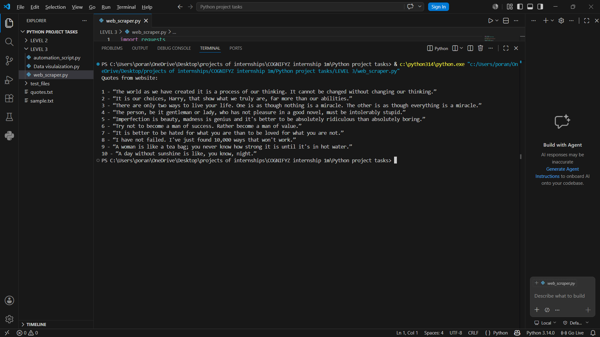
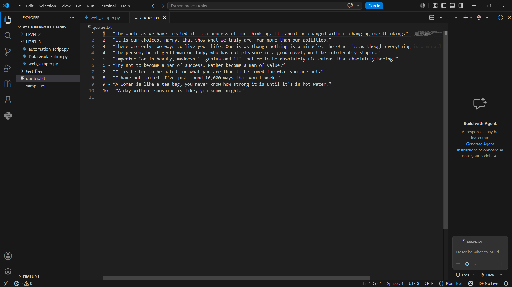

# Python Web Scraper

## Overview
A Python-based web scraper that extracts quotes from a website using BeautifulSoup and stores them into a text file.

---

## Features
- Extracts website data
- Parses HTML content
- Stores extracted quotes into a text file
- Beginner-friendly automation project

---

## Technologies Used
- Python
- Requests
- BeautifulSoup

---

## Screenshots

### Scraper Output

### Extracted Quotes File

